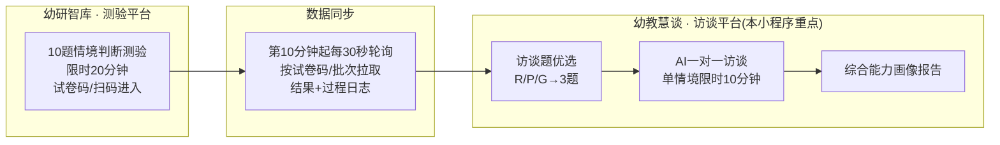
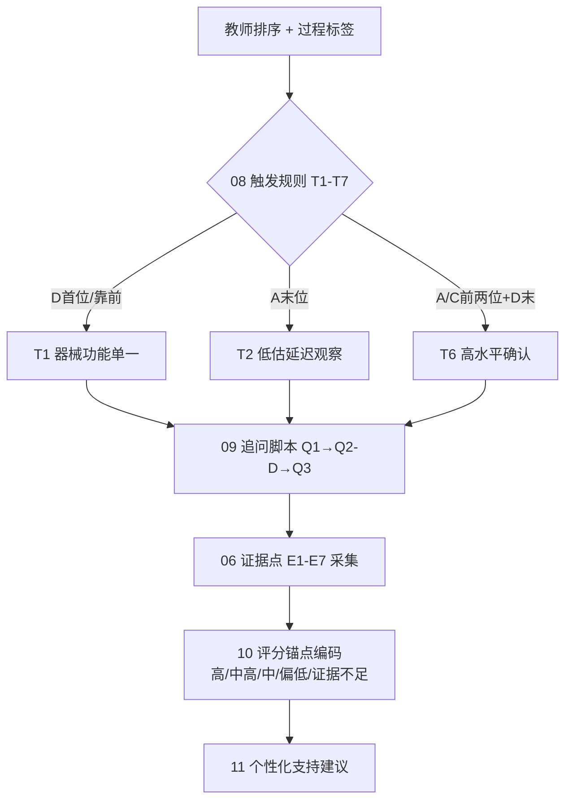
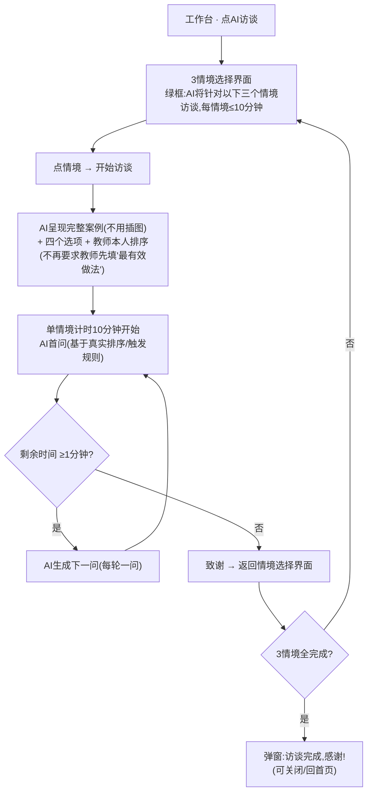

# 幼儿园教师「游戏支持与引导能力」AI 测评小程序 —— 设计规范

> 版本 **v2.0** ｜ 2026-07-02 ｜ 依据完整数据源重写
> 数据来源:《既定指标框架说明》《测验实施与AI访谈流程》《AI访谈实施手册》《综合报告生成手册》《10题测试题》《10题赋分表》《10游戏能力映射表》**《10题目知识库(每题13表)》《AI辅助访谈修改 7月1日》**
> 配套原型:`prototype.html`

---

## 0. v2.0 关键修订(相对 v1.0)

| # | 修订点 | 依据 |
|---|---|---|
| 1 | 明确 **双平台架构**:测验在「幼研智库」,访谈在「幼教慧谈」 | 7月1日修改 |
| 2 | 补充 **数据同步机制**(第10分钟起每30秒轮询) | 7月1日修改 |
| 3 | 知识库不是"待补",而是 **每题13张结构化表**,即 AI 访谈资料包本体 | 10题知识库 |
| 4 | 引入完整证据框架:**E1-E7 证据点 / P1-P7 偏误 / T1-T7 触发 / Q1-Q7 追问脚本** | 知识库 06-10 表 |
| 5 | 访谈交互细化:**单情境限时10分钟**、先呈现案例+排序、已完成可回看 | 7月1日修改 |
| 6 | 过程数据明确为 **8 项指标 + 综合指数** | 知识库 12 表 |

---

## 1. 产品概述

### 1.1 定位
面向**幼儿园一线教师**的专业能力测评与发展工具。通过 10 个真实游戏情境判断排序 + AI 一对一访谈,生成基于既定指标体系的**游戏支持与引导能力画像**及个性化学习建议。测验定位水平、过程数据解释判断方式、访谈确认能力机制、报告面向成长。

### 1.2 双平台架构 ⭐
本项目由**两个平台/小程序**协作:



- **幼研智库(测验平台)**:教师完成 10 题测验,限时 20 分钟;支持**输入试卷码**或**扫小程序码**进入;须绑定**统一教师姓名**用于数据同步与访谈任务生成。
- **幼教慧谈(访谈平台)**:教师扫码进入,工作台点「AI访谈」,完成系统自动生成的 **3 个情境**访谈,并查看报告。

### 1.3 目标用户
| 角色 | 场景 |
|---|---|
| 幼儿园教师(主) | 测验 → AI访谈 → 查看画像与建议 |
| 研究/运营团队 | 维护题库、知识库、优选规则、提示词、质量审核 |
| 园所管理者(二期) | 群体画像、教研规划 |

### 1.4 核心红线(全系统必须遵守)
1. 计分与筛题是**确定性程序**,AI 不参与打分。
2. AI 访谈**不暴露**专家排序 / 得分 / 标准答案,只围绕教师真实排序追问。
3. 最终 3 题 ≠ 最低分题,而是**最能解释判断机制**的题,且主二级指标尽量不同质。
4. 报告每条判断必须**可回溯**到具体题目 / 过程标签 / 访谈原话。
5. 过程数据波动 ≠ 能力弱,只作访谈线索。

---

## 2. 指标体系(全系统统一语言)

禁用旧"五维能力",统一使用 3 个二级 / 7 个三级指标。

| 二级 | 二级指标 | 三级 | 三级指标 | 核心观测点 |
|---|---|---|---|---|
| **A** | 对游戏的特点、价值的理解 | A1 | 对游戏特点的理解 | 游戏本质特征(自主性) |
| | | A2 | 对游戏价值的理解(游戏中的学习) | 独特的学习发展价值 |
| | | A3 | 对游戏价值实现的认识 | 价值发挥的长远、递进机制 |
| **B** | 游戏条件的保障 | B1 | 游戏环境创设 | 场地/时间/材料分析与投放 |
| | | B2 | 教师在幼儿游戏中的角色 | 支持者、合作者、引导者 |
| **C** | 游戏支持与指导 | C1 | 游戏中的观察 | 观察意识、游戏框架、状态识别 |
| | | C2 | 对游戏行为的分析与回应 | 行为分析、介入时机、支架适宜性 |

每个三级指标均配**发展脉络(4级递进)** 与**理想水平锚点**,供 AI 判断回答深度,不向教师暴露。

---

## 3. 10 题与指标映射

| 题号 | 情境简称 | 主二级 | 主三级 | 次级 | 访谈诊断焦点 |
|---|---|---|---|---|---|
| 1 | 篮球架玩水 | C | C2 | A1 | 自主生成游戏与安全规则的平衡 |
| 2 | 幼儿频繁求助 | C | C2 | C1 | 透过求助表面判断真实需要 |
| 3 | 区域停留短 | C | C1 | C2 | 频繁转换背后的原因 |
| 4 | 未参与小组建构 | C | C2 | B2 | 个体兴趣转化为共同建构资源 |
| 5 | 兴趣点与常规价值不符 | A | A1 | A3 | 儿童游戏体验 vs 成人现实判断 |
| 6 | 材料选择无层次 | B | B1 | C2 | 材料层次与适度挑战 |
| 7 | 艾莎公主不运动 | C | C2 | A2 | 角色兴趣转化为运动经验 |
| 8 | 引水难题未解 | C | C2 | B1 | 支架恢复探究而非替儿童完成 |
| 9 | 飞行棋各走各的 | C | C2 | C1 | 通过体验/协商促进规则理解 |
| 10 | 跳绳秩序混乱 | C | C2 | B2 | 组织幼儿参与规则形成 |

> ⚠️ 8 题主指标为 C,筛题时**尽量不选 3 道同为 C 的题**,保证题型分散。

---

## 4. 打分模块(确定性查表)

`000 10题赋分.xlsx` = **24 排列 × 10 题** 的预标定分数表:
- 24 行 = 4 做法(A/B/C/D)全排列(4! = 24);10 列 = 第 1~10 题;格子 = 0~4 分(专家预定)。
- 打分逻辑:`教师拖拽顺序 → perm_id → 查该题列 → 读出 0-4 分`。纯查表,毫秒级,可前端完成。
- 派生:总分、平均分、总体水平、常模百分位、每题相对个人均值偏离值 **RD**。

> 🔧 唯一对接点:与研究团队确认「24 行 ↔ 排列顺序」的约定(建议导入模板显式加 `order` 列)。

---

## 5. 过程数据采集(8 项 + 综合指数)

来自知识库「12 过程性数据」表,前端埋点采集,后端计算:

| 指标 | 计算/记录口径 | 强触发条件 |
|---|---|---|
| 总作答时长 | 呈现→提交秒数;转同题百分位/Z分 | > P75 增强,> P90 强线索 |
| 首位修改轨迹 | 首位选项变化路径(如 D→A→C) | 修改≥1次且最终风险选项首位 |
| 末位修改轨迹 | 末位选项变化 | 末位在关键选项间切换 |
| 修改次数 | 提交前拖拽调整次数 | ≥2 增强,≥4 强线索 |
| 关键停顿点 | 各选项附近停顿时长(需前端记录聚焦时间) | > 个人均值+1SD 或同题P75 |
| 首反应选项 | 第一次放到首位的选项 | 首反应与最终不一致=好线索 |
| 排序路径振荡 | 是否在两取向间反复换位 | 振荡≥2次 |
| 极快作答 | 时长 < 同题P25 且无修改 | 极快+风险模式 |
| **过程综合指数 P-IVI** | 人工规则合成:长时+多改+首末变化+关键停顿 | 满足≥2项过程异常提高入选优先级 |

> 前端必须保存**修改路径**,而非只存最终答案。

### 5.1 时间参数的作用边界(重要)
- **评分不需要时间**:总分/每题分/RD/常模定位仅由最终排序查表得出,与用时、修改无关。
- **时间用于**:P 分筛选(P-IVI 成分)、AI 访谈触发的过程增强条件、20分钟限时/超时自动提交。
- 因此时间必采,但**时间长 ≠ 能力弱**,只作访谈线索,不直接判定能力。

### 5.2 前端过程埋点字段清单
埋点在**测验平台(幼研智库)**答题页采集,随作答一起同步。分「必采 / 选采」:

| 字段 | 级别 | 类型 | 采集时机 / 口径 | 支撑指标 |
|---|---|---|---|---|
| `paper_code` / `batch_id` / `teacher_name` | 必采 | string | 进入测验时绑定 | 数据同步键 |
| `item_id` | 必采 | string | 每题 | 全部 |
| `final_ranking` | 必采 | array[4] | 提交时的最终排序,如 `["C","A","B","D"]` | 评分 |
| `enter_ts` / `submit_ts` | 必采 | epoch ms | 该题呈现 / 离开时间戳 | 总作答时长 |
| `duration_ms` | 必采 | int | `submit_ts - enter_ts`(前端算或后端算) | 总时长、极快作答 |
| `first_ranking` | 必采 | array[4] | 首次形成完整排序时的顺序 | 首反应、首/末位修改 |
| `revise_count` | 必采 | int | 提交前拖拽/换位次数 | 修改次数 |
| `move_log` | 必采 | array | 每次调整的轨迹:`[{ts, from_pos, to_pos, option}]` | 修改路径、首末位轨迹、路径振荡 |
| `first_response_option` | 选采 | string | 第一个被放到首位的选项 | 首反应选项 |
| `focus_dwell` | 选采 | map | 各选项聚焦/触控停顿累计毫秒:`{"A":1200,"D":4300}` | 关键停顿点 |
| `enter_leave_events` | 选采 | array | 题目进入/离开(切后台、翻页往返) | 疑似中断识别 |
| `total_exam_ms` | 必采 | int | 整卷用时(用于20分钟限时判断) | 限时/超时自动提交 |
| `submit_status` | 必采 | enum | `已提交` / `超时自动提交` / `进行中` | 是否进入访谈优选 |

采集建议:
- **精度**:时间戳毫秒级即可;`focus_dwell` 无需毫秒精确,合并 <300ms 抖动。
- **move_log 是关键**:首反应、首末位摇摆、路径振荡都从它派生,不必各存一份;只存最终答案则这些过程指标全部丢失。
- **隐私**:`focus_dwell`/`enter_leave_events` 属行为数据,须在隐私指引中说明用途(仅用于本人能力分析)。
- 后端据此计算 8 项指标 + P-IVI,写入 `process_summary`。

---

## 6. 访谈题优选:R / P / G 三路 → 3 题

| 路径 | 依据 | 产出 |
|---|---|---|
| **R 分** | 结果性偏离题(RD 大) | 2 候选 |
| **P 分** | 过程性异常题(摇摆/高修正) | 2 候选 |
| **G 分** | 结果—过程关系最值得解释题 | 2 候选 |

合并去重 → 计算证据强度 FES → **能力覆盖校验**(避免主二级指标同质) → 增补/保留/替换 → **最终 3 题 + 每题触发原因**。
输入:10题结果性数据 + 过程性数据 + 题目知识库规则;输出进入访谈资料包。

---

## 7. 题目知识库 = AI 访谈资料包(每题 13 张表)⭐

10 份 xlsx,每份 13 个工作表,结构完全一致。这是访谈与报告的**专业背景本体**,直接映射为后端数据与 AI 提示词上下文。

| 表 | 名称 | 内容 | 系统用途 |
|---|---|---|---|
| 01 | 基本信息 | 题号(GSYG_01)、名称、来源、年龄班、核心冲突、主/次二级三级指标、观测点、核心测评指向、**实证赋分协调** | 索引/定位 |
| 02 | 情境结构 | 情境线索→题干证据→专业解释→测评意图→访谈关注点 | 追问背景 |
| 03 | 测评意图 | 高水平表现 vs 低水平风险 vs 关联偏误 | 证据方向 |
| 04 | 专业路径与实证校准 | 4 选项→4 路径:**高分锚点 / 协调路径 / 风险路径** + 建议排位 | 首末位判断 |
| 05 | 选项逐项解释 | 每选项排首位/末位的意义 + 关联证据点 + 触发 | 排序解读 |
| 06 | **能力证据点 E1-E7** | 每条证据的高质量表现 / 低水平缺失 / 从哪看出 | 证据采集与编码 |
| 07 | **常见偏误 P1-P7** | 偏误类型、首末位表征、需访谈核查、追问脚本 | 偏误识别 |
| 08 | **访谈触发规则 T1-T7** | 结果性触发条件 + 过程性增强条件 → 偏误/缺口 → 访谈目标 → 调用脚本 → 优先级 | 触发引擎 |
| 09 | **AI追问脚本 Q1-Q7 + Q-stop** | 每问:适用触发、访谈阶段、问题文本、诊断目标、目标证据、下一步去向 | 对话生成 |
| 10 | 评分锚点 | 高/中高/中/偏低/证据不足 5 档 + 编码建议 | 访谈后编码 |
| 11 | 个性化支持建议 | 7 类支持型(补强/深化/巩固) + 学习活动 + 后续观察指标 | 报告建议 |
| 12 | 过程性数据 | 见第 5 节 8 指标 | 访谈线索 |
| 13 | 实证校准说明 | 三层关系:**赋分定位 / 指标解释 / 访谈确认**,不互相替代 | AI 调用规则 |

### 7.1 证据—偏误—触发—脚本 联动(以第1题为例)

- **E1-E7**(第1题):E1指标定位、E2儿童游戏意义识别、E3观察分析判断、E4介入时机、E5介入方式适宜、E6年龄适宜性/长期效果、E7文化适宜性/教师角色。
- **T1-T7** 各带**结果性条件 + 过程性增强条件**(如 T1:D首位 + 用时短→稳定功能化 / 反复调整→冲突)。
- **Q1-Q7**:Q1回放理解→Q2指标定位→Q3判断依据→Q4现场策略→Q5发展适宜→Q6文化适宜→Q7迁移;`Q-stop` 证据充分即收束,避免机械追问。

---

## 8. AI 一对一访谈流程与交互规则 ⭐

### 8.1 访谈流程


### 8.2 计时与边界规则(硬约束,来自 7月1日修改)
- **10 分钟是单情境计时**,不是三情境总计时。
- AI 生成问题前**剩余 ≥1 分钟**才生成新问题;**< 1 分钟**不再生成但**保存当前记录**。
- 教师正在回答时**超过 10 分钟不强制中断**,等待提交;提交后该情境标记「已完成」。
- 超 10 分钟仍未提交:提示「本情境访谈时间已到,请尽快提交当前回答」。

### 8.3 情境选择界面状态
- **已访谈**:左上角**红色打勾**;点击后按键为「退出案例 / 回看访谈」;**默认不可重新访谈,只可回看**。
  - 回看内容:情境题干、四个选项、本人原排序、AI 每轮问题、教师每轮回答、提交时间。
- **未访谈**:点击可开始访谈。

### 8.4 追问原则
每轮**只问一个问题**;先"接住"回答,再围绕**缺失证据**(E1-E7)追问具体判断/现场语言/后续策略;后台维护**证据账本**(已获/缺失/判断假设/风险标签/下一轮目标);不诱导预设答案。支持**语音 + 文字**输入。

---

## 9. 综合能力画像报告

生成逻辑(《报告生成手册》):
1. **结果定位** — 赋分/总分/常模,访谈不覆盖得分。
2. **过程解释** — 用时/修改/摇摆/P-IVI 解释判断如何形成。
3. **访谈确认** — 能否说明游戏意义/介入依据/现场语言/后续支持/迁移。
4. **三源融合** — 一致则增强,不一致则解释原因并标注可信度。
5. **二级指标画像** → **七个三级指标**展开(哪些证据充分/待观察)。
6. **证据回填** — 每条判断回到题目/过程标签/访谈原话。
7. **学习建议** — 对齐指标编码,强调年龄适宜/长期效果/文化适宜(来自各题「11 支持建议」)。
8. **审核输出** — 非评判、不过度解释、不泄露标准排序 → 导出 DOC/PDF。

报告可呈现分数/维度/证据,但**不暴露**标准排序、专家答案、评分规则。

---

## 10. 页面清单(对应 prototype.html)

| 平台 | # | 页面 | 关键要素 |
|---|---|---|---|
| 测验 | P1 | 首页/登录 | 试卷码/扫码、绑定教师姓名 |
| 测验 | P2 | 测评说明 | 20分钟限时、答题须知 |
| 测验 | P3 | 答题页(拖动排序) | 情境+4做法排序、进度、计时、过程埋点 |
| 测验 | P4 | 提交/同步中 | 赋分→过程→R/P/G 遴选 |
| 访谈 | P5 | 工作台 | AI访谈入口、测评结果概览 |
| 访谈 | P6 | 3情境选择 | 3卡片、R/P/G入选理由、已/未访谈状态、红勾 |
| 访谈 | P7 | 访谈开始引导 | AI形象、语音/文字说明、单情境10分钟 |
| 访谈 | P8 | 访谈(呈现案例+排序) | 完整题干+4选项+本人排序、开始计时 |
| 访谈 | P9 | 访谈对话 | 气泡、单轮一问、剩余时间、页面底部注明「内容由AI生成，仅供参考」 |
| 访谈 | P10 | 证据账本(后台) | E点定位、已获/缺失、追问目标、编码 |
| 访谈 | P11 | 回看访谈 | 题干/选项/原排序/每轮问答/提交时间 |
| 访谈 | P12 | 报告·能力画像 | 雷达图(7三级 vs 理想) |
| 访谈 | P13 | 报告·二级指标解读 | A/B/C 优势/发展点、证据可回溯 |
| 访谈 | P14 | 报告·学习建议 | 3方向对齐指标、资源推荐 |
| 访谈 | P15 | 个人中心/历史报告 | 档案、成长对比、历史报告 |

---

## 11. 数据结构(核心表)

```
-- 固定资料(系统建设阶段,带 version)
questions(version, item_id, stem, options{A,B,C,D}, secondary_code, tertiary_code, observation_points[], sub_indicators[])
score_table(version, item_id, perm_id, order_str, score)          -- 24×10 查表
knowledge_base(version, item_id, sheet_no, field_key, content)    -- 13表结构化(或按表分列)
kb_evidence(version, item_id, code[E1-E7], high_desc, low_desc)
kb_trigger(version, item_id, code[T1-T7], result_cond, process_cond, target, scripts[], priority)
kb_script(version, item_id, code[Q1-Q7], stage, question_text, goal, evidence[], next)
kb_anchor(version, item_id, level, criteria, coding)
kb_suggestion(version, item_id, type, goal, activities, follow_indicator)

-- 教师数据(测验平台采集)
teacher(teacher_id, name, kindergarten, class, paper_code, batch_id)
teacher_item_result(teacher_id, batch_id, item_id, final_ranking, first_ranking)
raw_process_log(teacher_id, batch_id, item_id, duration, revise_path[], first/last_swap, pause_points, oscillation, submit_status)

-- 计算/遴选/访谈/报告
result_summary(teacher_id, item_score(0-4), total, mean, RD, level, norm_pct)
process_summary(teacher_id, P-IVI, process_tags[])
final_interview_items(teacher_id, item_id×3, select_source(R/P/G), FES, focus, trigger_reason)
interview_session(teacher_id, item_id, status, elapsed, submit_time)
dialogue_log(session_id, round, ai_question, teacher_answer, ts)
evidence_ledger(session_id, got[], missing[], hypothesis, risk, next_goal)
item_evidence_summary(session_id, tertiary_code, evidence_code, level)
capability_report(teacher_id, secondary/tertiary画像, strengths, gaps, suggestions[])
```

---

## 12. 表格如何录入系统(ETL 导入)

**原则**:标准化导入 + 版本管理,不手工敲、不代码写死。

```
研究团队填标准模板.xlsx → 导入脚本/管理后台(①格式校验 ②一致性校验 ③排列口径转换) → 数据库(带version,旧版保留) → 后端按version读取
```

- **模板**:题库、赋分(含显式 `order` 列)、映射、13表知识库,各一套固定表头。10份知识库已是很好的模板基础。
- **校验**:分值0-4;24排列不重不漏;题号在题库/赋分/映射/知识库**四处一致**;指标映射字段齐备。
- **版本**:每次导入生成 `version`;教师作答绑定当时版本,保证历史结果可复现。
- **知识库解析注意**:10份 xlsx 用 `x:` 命名空间前缀 + 内联 `t="str"` 存储,解析需匹配 `<x:row>/<x:v>`。
- 一期:导入脚本即可;二期:再做上传管理后台(在线校验/版本对比/一键发布)。

---

## 13. 技术方案与微信小程序合规

| 层 | 建议 |
|---|---|
| 前端 | 微信小程序原生 / Taro;拖拽排序 `movable-view`;图表 ec-canvas |
| 打分/筛题 | **确定性后端服务**,非 AI |
| AI 访谈 | Claude(claude-opus-4-8)+ 系统提示词 + 单题提示词 + Q脚本 + 动态追问;知识库作 RAG 背景 |
| 语音 | `RecorderManager` 录音 → 后端 ASR(一期"说完再转") |
| 报告 | 服务端生成 PDF/DOC → `downloadFile`/`openDocument` 或分享链接 |
| 平台间 | 测验平台 → 每30秒同步接口 → 访谈平台(按试卷码/批次,覆盖/增量) |

**合规硬门槛**:
1. **类目资质**:教育类目,需 ICP 备案 + 企业主体 + 相关资质。
2. **内容安全**:UGC(语音转写)与 AI 生成内容均须过 `msgSecCheck`/`mediaCheckAsync`;AI 问答需人工审核机制 + 可追溯日志。
3. **隐私**:采集姓名/园所/语音,须配置《隐私保护指引》并授权;录音需 `scope.record`。
4. **LLM 调用**:小程序不能直连第三方,必须经自有已备案后端。

---

## 14. 质量控制清单

- [ ] 题号/题干/选项/赋分/映射/知识库六处题号一致
- [ ] 每题 13 表字段齐备,指标名称严格用规范名(禁"五维")
- [ ] 24 排列口径与赋分表对齐并抽样验证
- [ ] 最终 3 题主二级指标不同质
- [ ] 访谈不泄露专家排序/得分/标准答案;每轮一问;不诱导
- [ ] 单情境 10 分钟计时规则正确(≥1分钟才生成新问题、超时不中断作答、超时未提交提示)
- [ ] 已完成情境红勾 + 只可回看
- [ ] 报告每条判断可回溯证据;非评判;导出前人工抽检

---

## 15. 迭代规划

- **v1.0**:双平台打通(测验→同步→访谈→报告),后台题库/知识库/优选/证据账本。
- **v1.1**:成长计划打卡、报告历史对比、学习资源库。
- **v2.0**:园所管理端群体画像、教研规划;多轮追访;题库扩展与自适应筛题。
